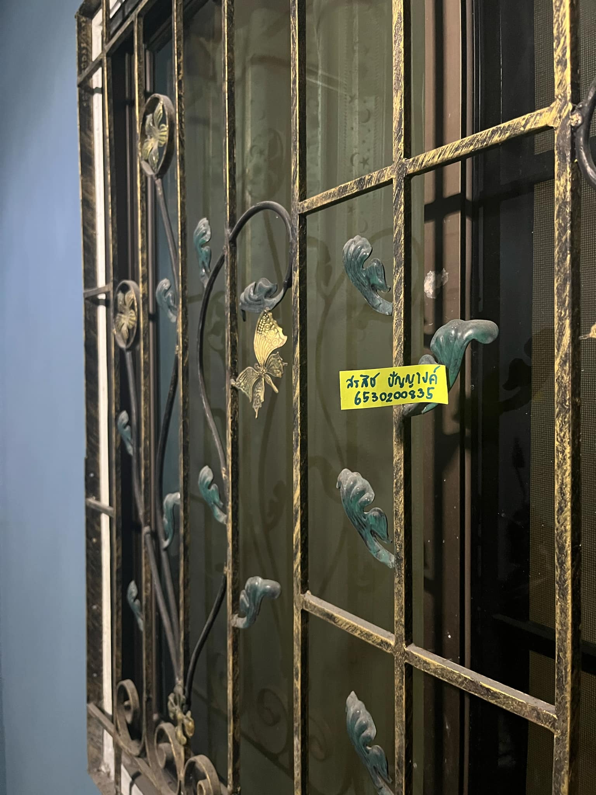

# Security Controls
<h2>เหล็กดัดหน้าต่าง</h3>

- Location: หมู่บ้านปรีชา

<h3>Control Function: Preventative Control</h3>

- ทำหน้าที่ป้องกันการเข้าถึงพื้นที่โดยไม่ได้รับอนุญาต เช่น การป้องไม่ให้ โจร, บุคคลภายนอก, หรือบุคคลที่เราไม่ได้รับอนุญาตเข้ามาภายในบ้านผ่านทางหน้าต่าง

- ลดโอกาสเกิดเหตุการณ์ไม่พึงประสงค์ การมีเหล็กดัดไว้ ทำให้โจรใช้เวลาและความพยายามมากขึ้นในการเข้าถึง สามารถลดความเสี่ยงของการถูกโจรกรรมได้

<h3>Type of Security Control: Physical Control</h3>

- เหล็กดัดเป็นวัตถุสามารถมองและสัมผัสได้ และสร้างอุปสรรคทางกายภาพเพื่อป้องกัน
  
- ป้องกันการเข้าถึงโดยไม่ได้รับอนุญาตผ่านทางหน้าต่าง ผู้ไม่หวังดีจะไม่สามารถผ่านเข้าไปทางหน้าต่างไปได้อย่างง่าย

